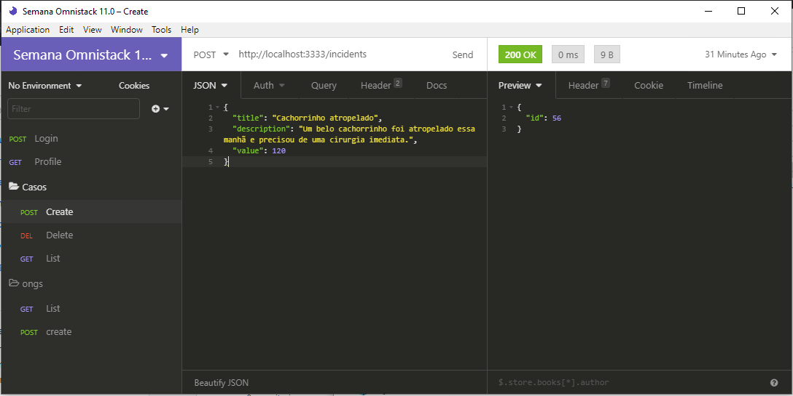
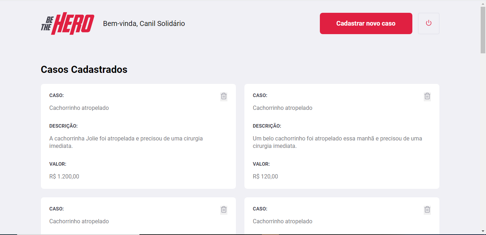
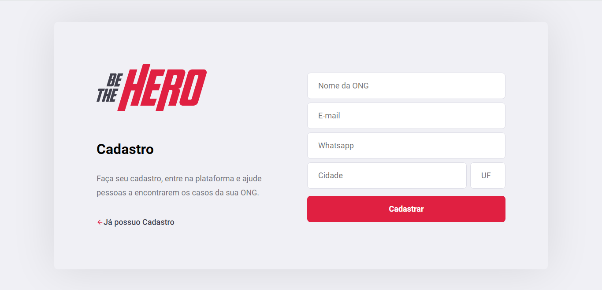
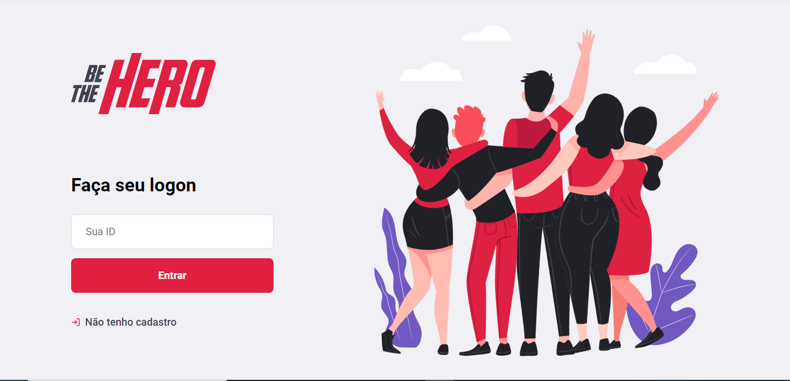
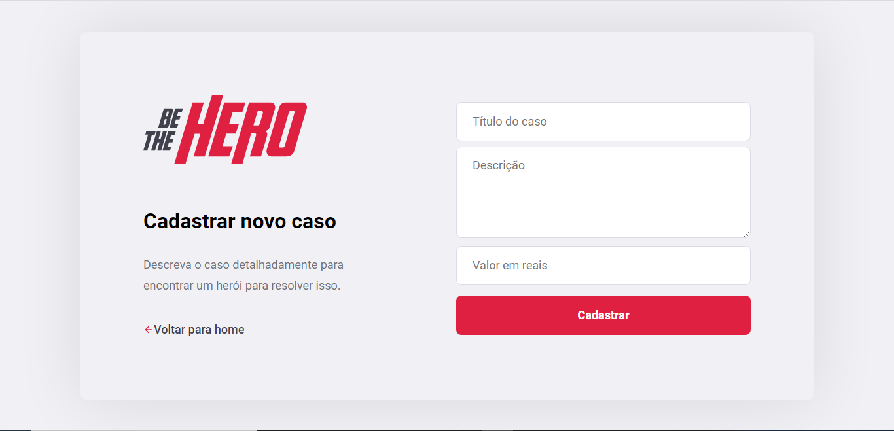
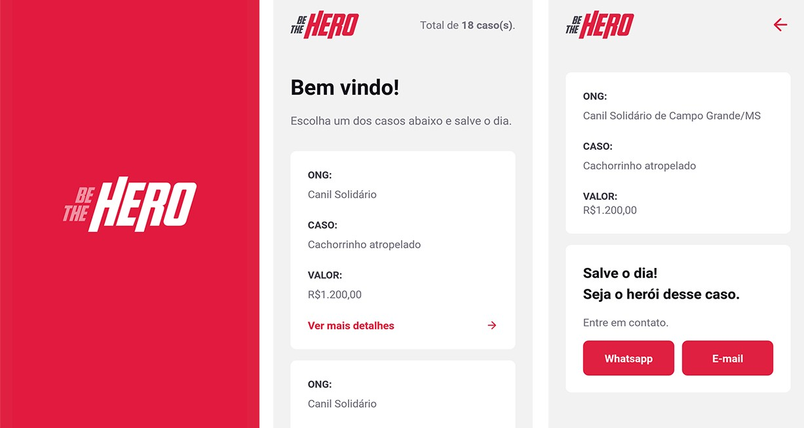

> Seja o Herói que ajudará ONGs a resolverem seus problemas!

# Objetivo
Criar, do zero, uma aplicação completa (back-end, front-end web e mobile) com o intuito de ser um sistema online
para auxílio e caridade de ***Organizações Não Governamentais*** (**ONGs**), onde um usuário do App mobile 
tem acesso aos casos e necessidades das ONGs e é capaz de, através do aplicativo, entrar em contato com a 
ONG para doar uma quantia em dinheiro para a resolução do caso.

# Construção do Sistema:
A aplicação foi construída em três etapas: **Back-end**, **Front-end Web** e **Mobile**.
Utilizando as mais diversas e poderosas ferramentas atuais.

## Back-end: 
O [NodeJS](https://nodejs.org/en/) foi a tecnologia que ficou a cargo do nosso back-end, demonstrou-se uma ferramenta poderosíssima
na construção de todo o ecossistema da aplicação, o [nodemon](https://www.npmjs.com/package/nodemon) foi uma ferramenta altamente
essencial devido a sua praticidade, já que ela pôde automatizar o *reload* do servidor sempre que algum arquivo era salvo.
O suporte à bibliotecas como a [express](https://www.npmjs.com/package/express) 
(criação das rotas), [cors](https://www.npmjs.com/package/cors) (configuração dos requests), [axios](https://www.npmjs.com/package/axios) (uso com api), knex e sqlite3 (conexão com BD). 

Para construção da *Base de Dados*, o modelo relacional foi o escolhido. Utilizando o [Knex](http://knexjs.org/) como construtor de 
***migrations*** e, logo, do Banco de Dados. O [SQLite](https://www.sqlite.org/), em sua versão 3, foi escolhido para a implementação da *Base de dados*
ser escalado para um banco mais complexo como o postgreSQL. Ele foi usado localmente, 
utilizado em conjunto com migrations da biblioteca knex.

## Front-end:
Já no front-end, quem dominou foi o [ReactJS](https://reactjs.org/), que, em conjunto com [HTML](https://developer.mozilla.org/pt-BR/docs/Web/HTML/HTML5) 
e [CSS](https://developer.mozilla.org/en-US/docs/Web/CSS) supriu todas as necessidades para a construção de uma aplicação enxuta.
O contato com o back-end foi feito por meio da biblioteca [axios](https://www.npmjs.com/package/axios). 

Esta é a tela inicial. Ela é responsável por listar todos os casos correspondentes à ONG que está ***logada*** na aplicação:

Aqui temos a tela de ***cadastro*** do sistema, onde a ONG deve entrar com seus dados, e uma ID exclusiva lhe é fornecida quando o cadastro é finalizado:

Aqui temos a tela de ***logon*** do sistema, onde a ONG deve entrar com a ID exclusiva que lhe é fornecida quando realiza seu cadastro:

Aqui temos a tela de ***cadastro de casos*** no sistema, onde a ONG deve entrar com o título, descrição e valor do caso:

## Mobile

A aplicação mobile foi criada utilizando [React Native](https://reactnative.dev/) (que é muito parecida com o ReactJS em algumas partes), 
através do [expo](https://expo.io/), uma ferramente que abstrai a instalação do android SDK, tornando mais simples e rápida a entrega de uma aplicação mobile.

No desenvolvimento dessa parte da aplicação foram usadas bibliotecas nativas para o React Native e para o próprio Expo, como também a funcionalidade Intl, capaz de formatar campos dependendo das unidades utilizadas.

A implementação de rotas e navegação ficou a cargo do [React Navigation](http://reactnavigation.org/), uma depedência do React Native
que gerencia vários modelos de rotas e navegação. O modelo de navegação que utilizamos foi o `stack navigator`.

Outra funcionalidade interessante foi a do `Linking`, que permite que o app abra outros apps que estão instalados no dispositivo
móvel. O consumo da ***API*** que foi construída em NodeJS, ficou a cargo do **Axios**.

Imagem das telas do app mobile:

## Meta

Riul Sudário de Souza 

rsudario47@gmail.com 

[Linkedin](https://www.linkedin.com/in/riul-sudário-de-souza-777ba719a)

[Portfolio](https://riulsudario.github.io)

## Contributing

1. Faça o _fork_ do projeto (<https://github.com/Riulsudario/be-the-hero/fork>)
2. Crie uma _branch_ para sua modificação (`git checkout -b feature/fooBar`)
3. Faça o _commit_ (`git commit -am 'Add some fooBar'`)
4. _Push_ (`git push origin feature/fooBar`)
5. Crie um novo _Pull Request_

